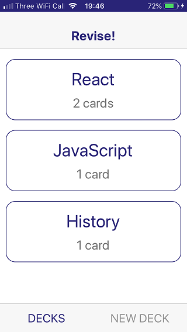
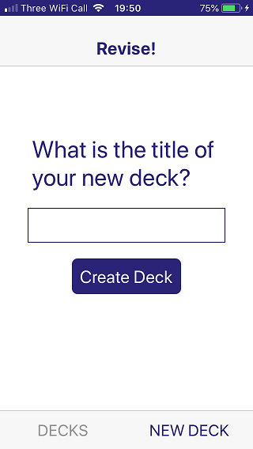
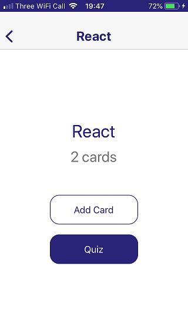
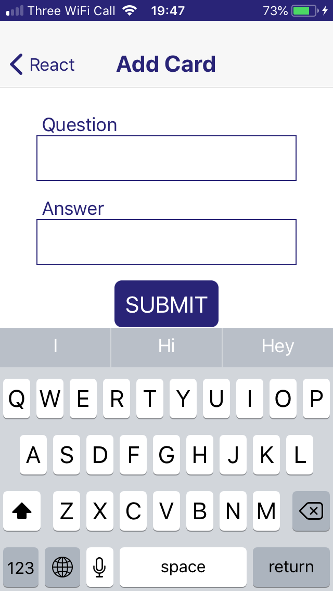
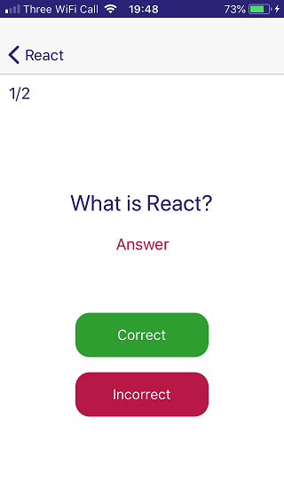
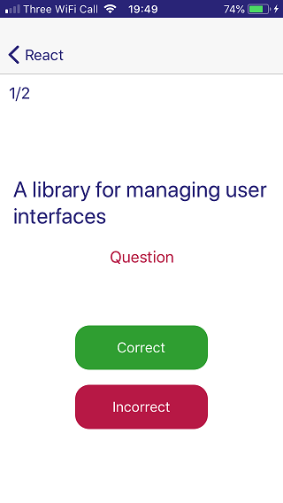
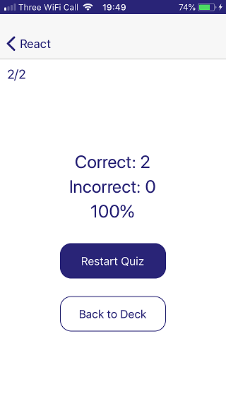

# Mobile Flashcards

This is Michael Arrastia's project submission for Udacity's React Native course (part of the
**Udacity React nano-degree**).

The project specification is defined by the [Udacity Rubric](https://review.udacity.com/#!/rubrics/1021/view) (course
sign-up is probably required to access this link).

## Installation

* install all project dependencies with `yarn install`
* start the server with `yarn start`

**Why Yarn?**
This project was bootstrapped with Create React Native App and, currently, Create React Native App does not
work well with NPM v5 due to
[bugs found in NPM](https://github.com/react-community/create-react-native-app/issues/233#issuecomment-305638103).

## Platform

The application has been developed using the [Expo](https://expo.io/) app running on an Apple iPhone 5S.

## Usage

The app developed for this project is a tool to manage revision flashcards and take revision quizzes.

The Home screen displays two tabs. The landing tab displays a list of decks which contain revision cards for a specific
category.

The second tab allows the creation of a new deck.

When a deck is created the app navigates to the Deck View. This view is animated with a gradual fade-in.
Here new cards can be added or a quiz can be started.

The screen to a card is a form with a question and answer.

The Quiz shows the progress through the deck and allows the user to score the result.

The card can be flipped over to view the answer.

When the Quiz is completed the score is shown.

The app also has a daily notification feature to remind the user to take a Quiz.

## Development Details

As mentioned earlier the application is bootstrapped using
[Create React Native App](https://github.com/react-community/create-react-native-app).

The app is underpinned by [React Native](https://facebook.github.io/react-native/) components including:
* View
* Text
* TouchableOpacity
* FlatList
* StyleSheet
* TextInput
* KeyboardAvoidingView
* Animated

[React Navigation](https://reactnavigation.org/) provides navigation and transitions between screens. The Mobile
Flashcards app uses a combination of Stack and Tab navigation.

State management is provided by Redux and React Redux. This allows connecting components to the store and dispatching
actions to update it.

There is a persistence layer that is supported by React Native's
[AsyncStorage](https://facebook.github.io/react-native/docs/asyncstorage.html)

Notifications are supported using Expo's Notifications and Permissions.

# Acknowledgments

The course example application _UdaciFitness_ provided useful patterns for the creation of this app.
